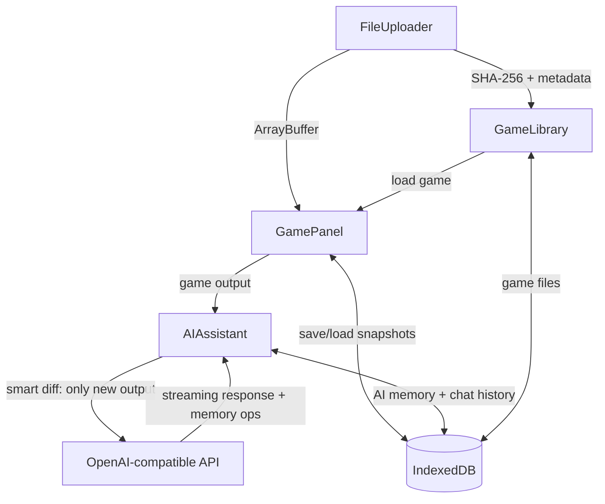

# Yarner

**Play classic text adventures with a real-time AI companion.**

[](https://github.com/sataaa/yarner/actions/workflows/ci.yml)

Yarner is a web-based interface for playing Z-Machine text adventure games (.z3/.z4/.z5/.z8) with an AI assistant that reads the game output in real time, keeps notes about your progress, and helps when you get stuck. No backend required -- everything runs in the browser.

---

## Features

- **Z-Machine in the browser** -- load any .z3, .z4, .z5, or .z8 file and play directly (ifvms.js + custom WebGlk)
- **AI Assistant** -- streaming chat with any OpenAI-compatible API; the AI follows the game in real time
- **Multi-provider support** -- LM Studio, Google Gemini, OpenAI, OpenRouter, Ollama, or any custom endpoint
- **AI Memory Notes** -- the AI maintains up to 20 numbered notes about your progress, persisted per game
- **Split-view interface** -- game terminal on the left, AI chat on the right
- **Save/Load** -- named save slots that preserve game state, AI chat history, and AI memory
- **Game Library** -- drag-and-drop upload, IndexedDB persistence, SHA-256 identification
- **Quick-load** -- 3 most recent saves per game shown on the home screen
- **Validated games** -- known games (Zork I, Zork II, etc.) are identified by SHA-256 and display a badge with their canonical name
- **4 visual themes**
- **i18n** -- Portuguese (PT-BR) and English, with automatic locale detection
- **Zero install** -- static SPA, works in any modern browser

---

## Quick Start

### Prerequisites

- Node.js 18+ and npm

### Install and run

```bash
# Clone the repository
git clone https://github.com/sataaa/yarner.git
cd yarner

# Install dependencies
npm install

# Start the development server
npm run dev

# Build for production
npm run build

# Preview the production build
npm run preview
```

Open `http://localhost:5173`, upload a Z-Machine game file, and start playing.

---

## AI Configuration

In the AI Assistant panel, select a provider preset or configure manually:

| Setting | Example |
|---------|---------|
| **Provider** | LM Studio, Gemini, OpenAI, OpenRouter, Ollama, Custom |
| **API URL** | `http://localhost:1234/v1` (LM Studio), `https://api.openai.com/v1` (OpenAI) |
| **Model** | Selected from dropdown (fetched from API) or typed manually |
| **API Key** | Optional for local servers; required for hosted providers |

Larger models (70B+, GPT-4o, Claude) produce significantly better assistance and memory tracking than smaller models.

---

## Tech Stack

| Layer | Technology |
|-------|------------|
| Framework | SvelteKit (SPA mode, `adapter-static`) + TypeScript |
| Z-Machine Runtime | [ifvms.js](https://github.com/curiousdannii/ifvms.js) + custom WebGlk |
| AI Integration | OpenAI-compatible API (streaming SSE) |
| Storage | IndexedDB via [`idb`](https://github.com/jakearchibald/idb) |
| Internationalization | [svelte-i18n](https://github.com/kaisermann/svelte-i18n) (PT-BR, EN) |
| Testing | Vitest + @vitest/coverage-v8 |
| CI | GitHub Actions |
| Deployment | Any static hosting (Vercel, Netlify, GitHub Pages) |

---

## Architecture Overview



For detailed architectural decisions, see [`docs/architecture.md`](./docs/architecture.md).

---

## Testing

217 tests with 99%+ line/branch/function/statement coverage. Coverage thresholds are enforced in CI -- the build fails if coverage drops.

```bash
npm test              # run all tests
npm run test:coverage # run with coverage report
```

---

## Documentation

- [`CONTRIBUTING.md`](./CONTRIBUTING.md) -- contribution guidelines
- [`docs/architecture.md`](./docs/architecture.md) -- system architecture overview
- [`docs/`](./docs/) -- development session logs and design notes

---

## Contributing

Contributions are welcome. Please read [`CONTRIBUTING.md`](./CONTRIBUTING.md) before submitting a pull request.

---

## License

MIT

---

**Version:** 0.8.0-alpha | **Status:** Active Development | **Started:** 2026-02-11
