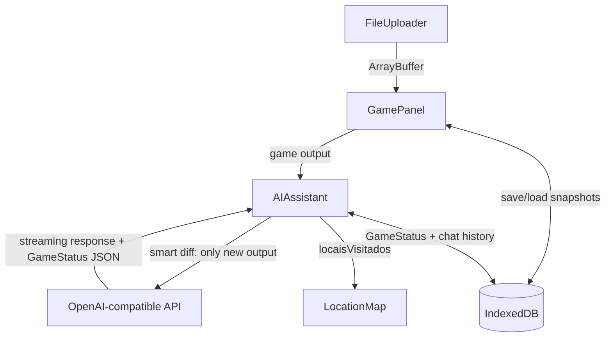

# 🧶 Yarner

**AI-Assisted Text Adventure Player**

[](https://github.com/sataaa/yarner/actions/workflows/ci.yml)

Yarner is a web-based interface for playing classic z-machine text adventure games with real-time AI assistance. Load any `.z3`–`.z8` file and play alongside an AI companion that reads the game, tracks your progress, maps visited locations, and helps you when you get stuck.

---

## ✨ Features

- 🎮 **Play Z-Machine Games** — Load `.z3`, `.z4`, `.z5`, `.z8` files directly in the browser (no installation)
- 🤖 **AI Assistant** — Chat with any OpenAI-compatible AI (Claude, GPT-4, LM Studio, Ollama, etc.) about the game
- 📊 **Split-View Interface** — Game on the left, AI assistant on the right
- 🗺️ **Location Map** — AI tracks visited rooms, explored/unexplored exits, and notes per location; expandable to a third column
- 💾 **Save / Load** — Named save slots persist game state + AI memory across sessions
- 📋 **Game Status Panel** — AI maintains structured context (current location, inventory, objectives, unexplored things)
- 🌐 **Web-Based** — Zero install; works in any modern browser

---

## 🚀 Getting Started

### Prerequisites

- Node.js 18+ and npm

### Installation

```bash
# Install dependencies
npm install

# Start development server
npm run dev

# Build for production
npm run build

# Preview production build
npm run preview
```

### AI Configuration

In the AI Assistant panel, enter:

- **API URL** — e.g. `http://localhost:55511/v1` (LM Studio), `http://localhost:11434/v1` (Ollama), or `https://api.openai.com/v1`
- **Model** — e.g. `meta-llama-3.1-8b-instruct`, `gpt-4o`, `claude-opus-4-6`
- **API Key** — optional for local servers; required for OpenAI/Anthropic

> **Note:** Larger models (70B+, GPT-4, Claude) produce significantly better game status tracking and location maps than small models (7B–8B).

---

## 🏗️ Tech Stack

| Layer | Technology |
|---|---|
| Frontend | SvelteKit (SPA mode, `adapter-static`) |
| Z-Machine Runtime | [ifvms.js](https://github.com/curiousdannii/ifvms.js) + custom WebGlk |
| AI Integration | OpenAI-compatible API (streaming SSE) |
| Storage | IndexedDB via [`idb`](https://github.com/jakearchibald/idb) |
| Deployment | Static hosting (Vercel / Netlify / GitHub Pages) |

---

## 📁 Project Structure

```
yarner/
├── src/
│   ├── routes/
│   │   └── +page.svelte          # Main page: layout + third column (location map)
│   └── lib/
│       ├── components/
│       │   ├── FileUploader.svelte   # Drag-and-drop .z* file loader
│       │   ├── GamePanel.svelte      # Game terminal: output, input, save/load UI
│       │   ├── AIAssistant.svelte    # AI chat panel: messages, status, map toggle
│       │   └── LocationMap.svelte    # Visited rooms, exits, notes
│       ├── stores/
│       │   ├── gameState.ts          # Central game state + save/load logic
│       │   ├── aiChat.ts             # AI chat store + locationMapExpanded flag
│       │   └── aiPersistence.ts      # IndexedDB: game status, chat history, save slots
│       ├── api/
│       │   └── claude.ts             # OpenAI-compatible API client (streaming)
│       └── zmachine/
│           └── zvm-wrapper.ts        # ifvms.js engine + custom WebGlk implementation
├── static/                           # Static assets
├── MANDAMENTOS.md                    # Project rules and principles
├── MEMORIA-PROJETO.md                # Full decision history and session logs
└── README.md                         # This file
```

---

## 🗺️ Architecture Overview



**Key design decisions:**

- **ifvms.js over Parchment.js** — ifvms.js exposes a full programmatic API for capturing I/O, which is essential for feeding game output to the AI. Parchment.js has no such API.
- **OpenAI-compatible API** — keeps the AI layer vendor-agnostic; works with local models (LM Studio, Ollama) and hosted providers (OpenAI, Anthropic via proxy).
- **Game status as AI memory** — instead of resending the full game log each time, the AI maintains a structured JSON status (location, inventory, objectives, `locaisVisitados`) that is persisted in IndexedDB and included as context in every request.
- **Additive merge for location map** — location data is never overwritten; new data from each AI response is merged into the existing map, so no information is lost even if the model returns a partial response.
- **Save slots include AI state** — each save slot stores the z-machine snapshot, the game history sent to the AI, and the full `GameStatus`, so restoring a slot also restores the AI's memory to that exact moment.

---

## 🧪 Testing

The three core TypeScript modules have full unit test coverage enforced by CI:

| File | Tests |
|---|---|
| `src/lib/api/claude.ts` | Streaming, parsing, error handling |
| `src/lib/stores/aiPersistence.ts` | IndexedDB CRUD round-trips |
| `src/lib/stores/gameState.ts` | Game lifecycle, save/load, engine mocks |

**83 tests · 100% line/branch/function/statement coverage** (thresholds enforced — CI fails if coverage drops).

```bash
npm test              # run all tests
npm run test:coverage # run with coverage report
```

---

## 📜 Documentation

- **[MANDAMENTOS.md](./MANDAMENTOS.md)** — Project rules, principles, and development guidelines
- **[MEMORIA-PROJETO.md](./MEMORIA-PROJETO.md)** — Full history of architectural decisions and session logs

---

## 🤝 Contributing

Read `MANDAMENTOS.md` before making any changes. Key points:

1. Always update `MEMORIA-PROJETO.md` with significant decisions
2. Document the *why*, not just the *what*
3. Keep solutions simple — MVP-first always

---

## 📄 License

TBD

---

**Project Started**: 2026-02-11
**Current Version**: 0.4.0-alpha
**Status**: 🚧 Active Development
